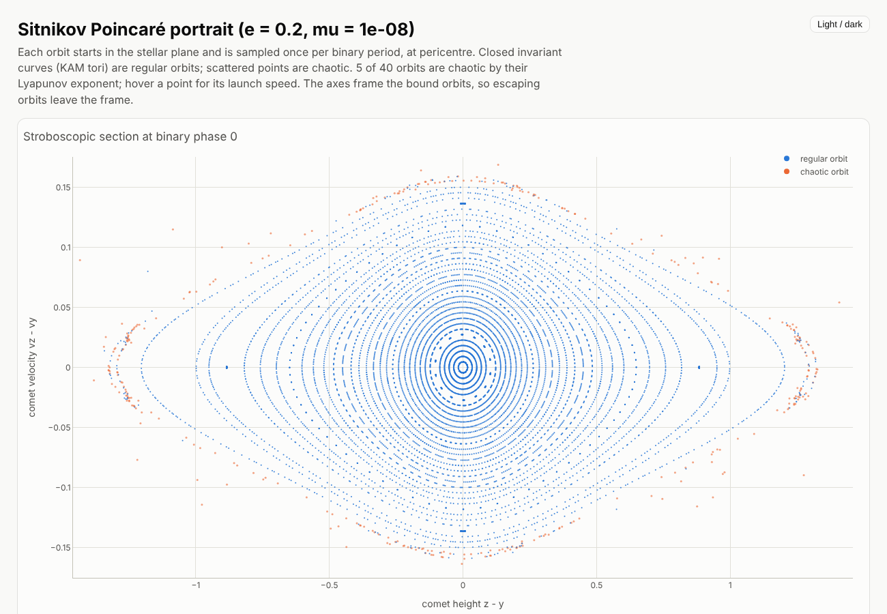
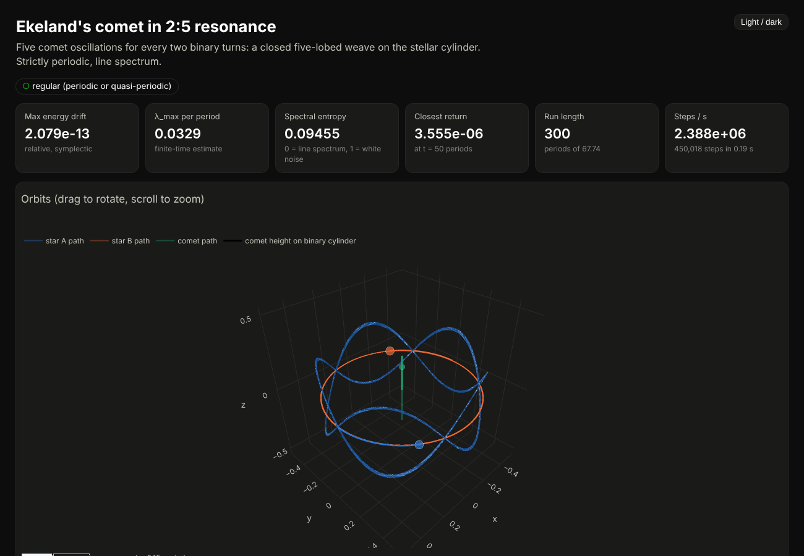

Gravitational Three-Body Symmetric
==================================

Simulations of the symmetric three-body problem from Ivar Ekeland's
*Mathematics and the Unexpected*: two equal stars orbit their centre of
mass while a comet moves along their symmetry axis. The circular-binary,
massless-comet limit is integrable. An eccentric binary (the Sitnikov
problem) or a comet heavy enough to push back on the stars makes it chaotic.

The package integrates the equations of motion with fixed-step
**symplectic** integrators (leapfrog, Yoshida 4th and 6th order), compiled
with numba, plus an adaptive DOP853 path for close encounters. Every run
writes CSV data files and an **interactive dashboard**: an animated 3D view
you can rotate, conservation checks, speeds and separations, phase
portraits, Poincaré sections and return maps, a power spectrum, and a
finite-time Lyapunov exponent.



Install
-------

Requires Python 3.13.

```bash
uv venv --python 3.13 && uv pip install -e ".[dev]"   # or: pip install -e ".[dev]"
```

Usage
-----

```bash
threebody demo                    # every demo below + runs/demos/index.html gallery
threebody demo figure8 --show     # one demo, opened in the browser
threebody symmetric --v0 0.1817 --periods 290           # the old ./sim.py .1817 290
threebody symmetric --ratio 3 --periods 30              # solve v0 for a 3:1 resonance
threebody symmetric --v0 0.156 --ecc 0.2 --periods 300  # Sitnikov (eccentric binary)
threebody symmetric --v0 0.167 --mu 0.1 --periods 300   # heavy comet
threebody nbody figure8 --periods 5 --method yoshida6
threebody nbody pythagorean --periods 70 --method dop853
threebody pendulum --ratio 2 --periods 80               # 2:1 "swing spring"
threebody portrait --ecc 0.2 --orbits 40                # Poincaré portrait
threebody verify                  # integrator verification on the SHO
```

Common options: `--periods` (run length in units of the model's natural
period: the binary period for the symmetric problem), `--steps-per-period`,
`--method {leapfrog,yoshida4,yoshida6,dop853}`, `--samples` (rows stored;
the integrator always runs at full resolution), `--animate-periods`,
`--out DIR`, `--show`, `--plotly {local,cdn,inline}`.

Each run directory contains:

| file | contents |
|---|---|
| `trajectory.csv` | sampled state. For the symmetric problem the columns are the original `t, r, vr, z, vz, y, vy, theta, w` |
| `events.csv` | every section crossing (comet through the stellar plane, binary phase 0, …), state interpolated to the crossing, `interval` since the previous one (the old `returnmap.csv`) |
| `lyapunov.csv` | running finite-time maximal Lyapunov exponent |
| `summary.json` | parameters, invariant drift, speed and distance statistics, periods, chaos diagnostics |
| `dashboard.html` | the interactive page (`plotly.min.js` is written once beside it, so it works offline) |

From Python:

```python
from threebody import SymmetricThreeBody, SimulationConfig, simulate, summarize

result = simulate(SymmetricThreeBody(v0=0.17), SimulationConfig(periods=190))
print(summarize(result)["chaos"])
```

Demos
-----

| name | what it shows | verdict |
|---|---|---|
| `sho` | verification run against the exact solution | regular |
| `ekeland-coil` | comet period = 3 binary periods; v0 solved by quadrature | periodic |
| `ekeland-weave` | 2:5 resonance: a closed five-lobed weave on the stellar cylinder | periodic |
| `ekeland-quasiperiodic` | the README's original v0 = 0.1817 | quasi-periodic |
| `sitnikov-chaos` | eccentric binary, e = 0.2 | chaotic |
| `heavy-comet` | comet mass 0.1 M; binary breathes, plane recoils | chaotic |
| `broken-symmetry` | Ekeland's set-up as a full 3D N-body problem, comet 0.001 off-axis: it is flung out sideways | chaotic |
| `figure8` | Chenciner–Montgomery choreography, 200 periods with yoshida6 | periodic, stable |
| `butterfly`, `moth`, `yin-yang`, `bumblebee` | Šuvakov–Dmitrašinović periodic orbits | periodic, unstable |
| `pythagorean` | Burrau's 3-4-5 problem ending in an ejection | chaotic |
| `swing-spring` | 2:1 resonant elastic pendulum with stepwise precession | regular |

The published Šuvakov–Dmitrašinović initial conditions have 6 digits and
close only to ~1e-3. The values in `threebody/demos.py` were re-converged
by Newton shooting and close to ~1e-11 after one period.



Physics and numerics
--------------------

See `notes.tex` for the derivation. The code integrates Ekeland's problem in
the Cartesian coordinates `(X, Y)` of one star plus the stellar-plane offset
`y` and the comet height `z`. The kinetic energy is diagonal in those
coordinates, so `H = T(p) + V(q)` is separable and the leapfrog and Yoshida
compositions are exactly symplectic. Energy errors oscillate but don't
drift, and angular momentum is conserved to round-off. Initial conditions
are in the centre-of-mass frame (`mu z + 2 y = 0`).

Diagnostics:

* **Lyapunov exponent:** a shadow orbit at separation 1e-9 is renormalised
  several times per period (Benettin et al.). The verdict is *chaotic* when
  the exponent stays above 0.1 per period and the run has accumulated more
  than 20 e-folds. For regular motion the finite-time estimate decays like
  `ln t / t`, so short runs report *inconclusive*.
* **Sections:** sign changes of event functions are located inside the
  integrator by regula falsi on the step's cubic Hermite interpolant, so
  section points are accurate to the integrator's precision, not the
  sampling interval.
* **Spectral entropy and closest return:** quick indicators of a line
  spectrum versus a broadband spectrum, and of periodicity.

### Bugs fixed in the original `sim_3body.py`

1. The star–star force used `G M / (2 r²)`; the stars are `2r` apart, so it
   is `G M / (4 r²)`. The binary orbited √2 too fast.
2. The stellar-plane recoil used `vy += -dt * mu/2 * vz` (a velocity, not
   an acceleration). The correct form is `vy += dt * G M mu (z - y) / d³`.
3. The leapfrog half-step for θ was `w*dt/.2` (5 dt), not `w*dt/2`.
4. The θ equation `w += -2 dt vr w / r` depends on a velocity, so the scheme
   in polar coordinates was not symplectic, and positions at half steps
   were printed next to velocities at whole steps.
5. Python 2 only (`print >>`, CSV opened as `"wb"`), and `numpy.float` no
   longer exists.

The spring pendulum script had two more: `v_l +=` was missing its `* dt`,
and the swing equation lacked the Coriolis term `-2 l̇ θ̇ / l`. It now
integrates in 3D Cartesian coordinates.

Verification
------------

`threebody verify` (and the test suite) check the integrators against the
simple harmonic oscillator:

```
method      steps/T   max |x - x_exact|   order
leapfrog        128           6.798e-03   2.001
yoshida4        128           2.642e-05   4.002
yoshida6         64           2.321e-07   5.995
Leapfrog vs its exact discrete solution cos(W n dt), cos(W dt) = 1 - (w dt)^2/2: 1.9e-13
Energy error, 10 vs 1000 periods: yoshida4 9.25e-05 / 9.31e-05 (bounded); dop853 7.9e-12 / 1.5e-10 (drifts)
```

The tests also check the comet period against an exact quadrature to 1e-9,
the binary period against Kepler, conservation laws, closure of every
periodic orbit, and the CLI outputs.

Development
-----------

```bash
black src tests && ruff check src tests && mypy && pytest
```

Example run (original version)
==============================

Vz = 0.1817, time = 290 periods


